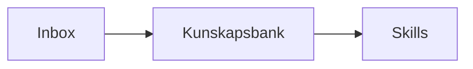

# Kunskapstratten

[GitHub repository](https://github.com/yllemo/kunskapstratten)

En lokal kunskapspipeline och webbapp för att konvertera dokument till
Markdown, organisera en kunskapsbank, chatta med valda underlag och köra
återanvändbara bearbetningsskills mot en lokal AI.

> **Lokalt verktyg utan inbyggd autentisering.** Behåll standardvärdet
> `127.0.0.1` om du inte själv lägger till ett säkert proxy-, autentiserings-
> och TLS-lager. Publicera aldrig mappar med importerade dokument eller
> runtime-data.

En lokal, Python-baserad implementation av tratt-arkitekturen:

```
Inbox / Landningsbrygga
        ↓
LLM Wiki-motor (MarkItDown + lokal AI)
        ↓
Kunskapsbank-repositorium (.md + YAML frontmatter)
        ↓
Valbara bearbetningsskills  ←  användaren väljer funktion och .md-underlag i GUI:t
```

**Ingen RAG, inga embeddings, inget sökindex.** Dokument väljs uttryckligen i
GUI:t när en bearbetningsskill körs. Skillens `SKILL.md` definierar funktionen
och instruktionerna; kunskapsbankens filer binds till körningen först när
användaren väljer dem.

Allt körs helt lokalt. Den enda "molntjänsten" som används är din egen
lokala AI-server (LM Studio, Ollama, vLLM, llama.cpp-server, etc.) via ett
OpenAI-kompatibelt API — inget skickas till OpenAI eller någon extern tjänst.

## Mappstruktur

```
kunskapstratten/
├── run.py                 # CLI-entrypoint (inget kommando = gui / process / status / watch / skills)
├── config.yaml             # Alla sökvägar + AI-inställningar (delas av ingest OCH GUI-chatten)
├── requirements.txt
├── src/
│   ├── config.py            # Läser config.yaml
│   ├── registry.py           # SQLite-register: vilka filer är processade
│   ├── converter.py           # MarkItDown-wrapper + bildhantering
│   ├── frontmatter.py          # Bygger YAML frontmatter
│   ├── ai_client.py             # OpenAI-kompatibel klient mot lokal AI
│   ├── enrich.py                 # AI-genererad titel/sammanfattning/taggar
│   ├── pipeline.py                # Knyter ihop ingest-flödet
│   ├── watcher.py                  # Kontinuerlig bevakning (polling)
│   ├── docstore.py                  # Läser/listar .md-dokument + frontmatter
│   ├── skillbuilder.py               # Skapar och läser bearbetningsskills
│   ├── webapp.py                      # Flask-app: bläddra, skills, chatt, redigering
│   ├── templates/                      # Jinja2-mallar (browse/doc/edit/skills/chat)
│   └── static/                          # CSS/JS för GUI:t (app.js + chat.js)
├── inbox/                  # <- Lägg nya filer här (landningsbryggan)
├── processed/               # Originalfiler flyttas hit när de är klara
├── kunskapsbank/              # Färdiga .md-filer (repositoriet)
│   └── images/                  # Extraherade/kopierade bilder
├── skills/_custom/           # Användarskapade bearbetningsskills
├── data/
│   └── registry.db               # Ingest-register (skapas automatiskt)
└── logs/
    └── pipeline.log                # Skapas automatiskt vid körning
```

## Installation

Kräver Python 3.10+.

```bash
cd kunskapstratten
python -m venv .venv
source .venv/bin/activate      # Windows: .venv\Scripts\activate
pip install -r requirements.txt
```

Skapa därefter din lokala konfiguration. `config.yaml` ignoreras av Git så
framtida nycklar, privata sökvägar och personliga inställningar inte råkar
publiceras:

```bash
# Linux/macOS
cp config.example.yaml config.yaml

# Windows PowerShell
Copy-Item config.example.yaml config.yaml
```

## Konfiguration

Allt styrs från `config.yaml`. De viktigaste delarna:

```yaml
paths:
  inbox: "./inbox"          # Var landningsbryggan ligger
  output: "./kunskapsbank"   # Var de färdiga .md-filerna hamnar

ai:
  enabled: true
  base_url: "http://localhost:11434/v1"  # Ollamas OpenAI-kompatibla endpoint
  model: "gemma4:26b"                    # Standardmodell i Ollama
```

Du kan peka `inbox` och `output` mot vilka mappar som helst på din maskin,
t.ex. en delad mapp eller en mapp som synkas från andra verktyg — sätt bara
absolut sökväg istället för relativ.

Har du ingen lokal AI-server igång kan du sätta `ai.enabled: false` — då
körs bara MarkItDown-konverteringen utan bildbeskrivningar eller
AI-genererade sammanfattningar/taggar (frontmatter fylls ändå i med
filnamn som titel).

## Användning

**Lägg filer i `inbox/`** (PDF, Word, PowerPoint, Excel, bilder, HTML,
ljudfiler m.m.) och kör sedan:

```bash
# Bearbeta allt nytt i inboxen
python run.py process

# Se status: hur många filer väntar, hur många är klara/felade
python run.py status

# Bevaka inboxen kontinuerligt (kör tills du avbryter med Ctrl+C)
python run.py watch --interval 10

# Tvinga om-bearbetning av redan processade filer
python run.py process --force
```

Varje fil i inboxen:

1. Får sitt innehåll hashat (SHA-256) och registreras i `data/registry.db`.
   Körs pipelinen igen bearbetas inte samma fil på nytt (om den inte ändrats).
2. Konverteras till Markdown med [MarkItDown](https://github.com/microsoft/markitdown).
3. Om filen är en bild, eller innehåller bilder, och `ai.use_for_image_description`
   är påslaget: MarkItDown skickar bilden till din lokala AI för en textbeskrivning
   som vävs in i markdown-texten.
4. Om filen själv är en fristående bildfil sparas dessutom en kopia av
   originalbilden i `kunskapsbank/images/`, och en ``-länk
   läggs överst i den genererade markdown-filen — så du får både originalbilden
   och AI:ns textbeskrivning av den.
5. Om `ai.use_for_metadata_enrichment` är påslaget: den lokala AI:n föreslår
   en bättre titel, en kort sammanfattning och taggar utifrån innehållet.
6. Ett YAML frontmatter-block byggs och skrivs överst i den nya `.md`-filen:

   ```yaml
   ---
   title: Exempeldokument
   source_file: rapporter/q3.pdf
   source_hash: 8f14e45f...
   converted_at: 2026-08-28T10:15:00+00:00
   tags: [ekonomi, kvartalsrapport]
   author: Exempel Författare
   summary: Kort AI-genererad sammanfattning av innehållet.
   source_type: pdf
   ---
   ```

7. Originalfilen flyttas från `inbox/` till `processed/` (samma relativa
   mappstruktur bevaras), och registret markeras `done` med sökvägen till
   den skapade `.md`-filen.

## Registret (vilka filer är processade)

`data/registry.db` är en SQLite-databas med en tabell `files`
(`source_path`, `content_hash`, `status`, `output_path`, `discovered_at`,
`processed_at`, `error_message`). Den fungerar både som "har jag redan
gjort den här filen"-koll och som revisionsspår. Öppna den gärna direkt
med valfritt SQLite-verktyg om du vill inspektera historiken:

```bash
sqlite3 data/registry.db "SELECT source_path, status, processed_at FROM files;"
```

`python run.py status` ger samma information i sammanfattad form.

## Bearbetningsskills

Kunskapstratten importerar och berikar dokument men skapar **inga skills
automatiskt**. En skill är istället en återanvändbar funktion med instruktioner
för hur valda delar av kunskapsbanken ska behandlas:

```
skills/_custom/
├── sammanfatta/SKILL.md       # medföljer som redigerbar standardskill
├── kvalitetsgranska/SKILL.md
└── skapa-rapport/SKILL.md
```

Skapa en skill i GUI:t med namn, beskrivning och arbetsinstruktioner. När den
körs väljer du exakt vilka `.md`-filer som ska vara underlag och kan lägga till
ett kompletterande uppdrag. Den lokala AI:n returnerar resultatet strömmande
som Markdown. Resultatet kan kopieras eller sparas tillbaka i kunskapsbanken.

Projektet levereras med **Sammanfatta dokument** som standardskill. Den lyfter
huvudpunkter, beslut, risker, oklarheter och rekommenderade nästa steg ur de
dokument som väljs vid körningen. Skillen kan redigeras eller ersättas precis
som andra skills.

Även **Fornnordisk pseudonymisering (demo)** medföljer. Den demonstrerar hur en
AI kan leta efter personuppgifter, byta personnamn mot humoristiska fornnordiska
namn och skapa en granskningsrapport. Den är uttryckligen ett roligt exempel,
inte verifierad anonymisering och inte avsedd för seriös produktion.

CLI-kommandot listar tillgängliga skills:

```bash
python run.py skills
```

### GUI:t: Bläddra, Skills, Chatta och Redigera

```bash
python run.py
# eller: python run.py gui
# öppna http://127.0.0.1:5000 i webbläsaren
```

Utan kommando startar `python run.py` GUI:t direkt (samma som `gui`).

**Bläddra** (`/browse`) visar dokumenten som katalogkort med fulltextsökning
(även i brödtexten), tagg- och filtypsfilter samt sortering på titel,
sökväg eller ändringsdatum. Sökresultat visar ett relevant textutdrag.

**Skills** (`/skills`) visar funktionerna du har skapat. Klicka **Kör skill**,
filtrera och välj dokument, ange eventuellt ett kompletterande uppdrag och kör.

**Chatta** (`/chat`) låter dig chatta mot kunskapsbanken direkt i
GUI:t. I sidopanelen väljer du vad som ska ingå i kontexten:

- **Aktiv skill** — välj en bearbetningsskill så används dess instruktioner
  tillsammans med frågan och det valda underlaget.
- **Lägg till dokument** — kryssrutor för enskilda dokument, med ett
  filter för att snabbt hitta rätt.
- **Tillfällig fil** — ladda in en fil bara för den aktuella chattsessionen.
  Den konverteras till kontext men sparas inte i inbox eller kunskapsbank.
- **I kontext** — de dokument som är valda just nu, med möjlighet att
  ta bort enskilda igen, plus en löpande uppskattning av antal tokens.

En visuell mätare visar uppskattad användning av modellens kontextfönster,
uppdelat på underlag, konversationshistorik och skillinstruktioner. Gränsen
styrs med `ai.context_window` i `config.yaml` och är 32 768 tokens som standard.

Chatten svarar med den **samma lokala AI som resten av tratten**
(ingest, metadataberikning) — inställningarna hämtas alltid från
`ai.*` i `config.yaml`. Det finns ingen separat AI-konfiguration i
webbläsaren: byt server/modell i `config.yaml`, så används det direkt
nästa gång du frågar. Svaret strömmas fram token för token, med en
stoppknapp medan det genereras.

En **"Chatta om detta dokument"**-länk på varje dokumentsida förväljer
dokumentet som kontext i den fria chatten.

**Redigera** — varje dokumentsida har en **Redigera**-länk som öppnar
hela filen (frontmatter + brödtext) i en textruta. **Spara** skriver
filen till disk. Sparas ogiltig YAML i frontmatter avbryts sparningen med
ett tydligt felmeddelande — filen på disk lämnas orörd.

På desktop används **Monaco Editor** (samma redigeringsmotor som i VS Code)
med Markdown-markering, radnummer, radbrytning, mörkt tema och `Ctrl/Cmd+S`.
På mobil används automatiskt en lättare textruta eftersom Monaco inte stöder
mobila webbläsare officiellt. Monaco hämtas som `@latest` från jsDelivr; om
nätverket saknas fungerar textrutan som fallback.

YAML-frontmatter visas som en formaterad, utfällbar metadatapanel i
dokumentvyn. Mermaid stöds genom kodblock med språket `mermaid`:

````markdown

````

Diagram renderas med `mermaid@latest`, följer ljust/mörkt tema och körs med
strikt säkerhetsnivå. Om biblioteket inte kan hämtas ligger Markdown-koden
kvar i dokumentet.

GUI:t följer Göteborgs Stads grafiska profil (Göteborgsblå `#0077bc`,
4px border-radius, Arial/Helvetica-typografi) och har ljust/mörkt läge —
växla med knappen (◐/☀) i headern, valet sparas i webbläsaren.

**Nytt dokument** skapar Markdown-anteckningar direkt i valfri undermapp,
med titel och taggar. Från dokumentvyn
kan originalfilen dessutom laddas ned som `.md`.

**Ladda upp** tar emot en eller flera filer via drag-and-drop eller filväljare
och lägger dem säkert i `inbox/`. Filtyper valideras mot
`supported_extensions` i `config.yaml`, befintliga filer skrivs aldrig över
och uppladdningen kan bearbetas direkt från resultatsidan.

På **Skills** kan du skapa funktioner med namn, beskrivning och instruktioner.
De sparas under `skills/_custom/`. Dokument väljs vid varje körning, vilket
gör att samma skill kan användas på olika delar av kunskapsbanken.

Varje skill-kort har även **Redigera kod**, som öppnar hela `SKILL.md` i
Monaco Editor på samma sätt som kunskapsbankens Markdown-dokument. YAML
valideras före sparning och måste innehålla `name` och `description`.

### Kom igång direkt — medföljande exempel

Paketet innehåller fyra färdiga exempeldokument i `kunskapsbank/`, så GUI:t visar innehåll direkt efter
uppackning utan att du behöver köra `process` först:

- `kom-igang.md` — hur du lägger till egna filer och håller allt uppdaterat
- `exempel/arkitektur.md` — tratt-arkitekturen från inbox till skills
- `exempel/lokal-ai.md` — hur du kopplar in LM Studio/Ollama/vLLM
- `exempel/skills-koncept.md` — hur bearbetningsskills fungerar i Kunskapstratten

Ta bort dem när du är redo för dina egna dokument:

```bash
rm -rf kunskapsbank/kom-igang.md kunskapsbank/exempel
```

## Köra som en tjänst

`python run.py watch` polar inboxen med jämna mellanrum. Vill du ha det
som en riktig bakgrundstjänst, wrappa kommandot i en systemd-unit
(Linux), en Scheduled Task (Windows) eller en launchd-agent (macOS) som
kör `python run.py watch` i projektmappen.

## Utveckling

```bash
pip install -r requirements-dev.txt
python -m unittest discover -s tests -v
```

GitHub Actions kör testsviten på Python 3.10 och 3.12. Se
`CONTRIBUTING.md` för bidragsflödet och `SECURITY.md` för säkerhetsmodellen.

## Integritet och repositorydata

`.gitignore` exkluderar lokal konfiguration, registerdatabas, loggar,
uppladdningar, originalarkiv och användarens kunskapsdokument. Endast sanerade
exempeldokument och medföljande standardskills är avsedda att versionshanteras.
Kontrollera alltid `git status` före en commit.

## Licens

Projektet är licensierat under [MIT License](LICENSE).
