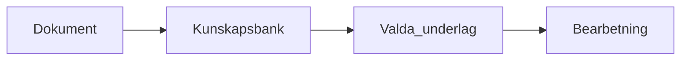

# Kunskapstratten

[GitHub](https://github.com/yllemo/kunskapstratten) · [Konceptguide](kunskapstratten-koncept.html) · [Säkerhet](SECURITY.md)

Kunskapstratten är en Python-baserad webbapp som omvandlar dokument till en
filbaserad kunskapsbank i Markdown. Bläddra bland artiklar, chatta med valda
underlag och använd återanvändbara skills för att bearbeta innehållet.

> **Lokalt verktyg utan inbyggd autentisering.** Behåll servern på
> `127.0.0.1`. Exponera inte GUI:t eller användardata publikt utan ett eget
> autentiserings- och TLS-lager. Väljer du en extern AI-server skickas
> underlaget till den servern.

## Funktioner

- **Filbaserad lagring:** Markdown för artiklar, skills och minne; JSON för
  importhistorik och GUI-inställningar. Ingen aktiv SQL-databas eller vektordatabas.
- **Dokumentimport:** ladda upp filer till inboxen och konvertera dem med
  [MarkItDown](https://github.com/microsoft/markitdown), med valfri AI-berikning.
- **Skalbar bläddring:** kort, lista eller tabell, sidindelning, fulltextsökning,
  sortering och taggar med artikelantal.
- **Markdown-redigering:** Monaco Editor på desktop och ett enklare textfält
  på mobil. Formaterad YAML-frontmatter och Mermaid i dokumentvyn.
- **Chatt:** valda KB-filer, tillfälliga bilagor, kontextuppskattning,
  Mermaid-diagram, kopierbara kodblock och export till kunskapsbanken.
- **Skills med dokumentförval:** skapa och redigera instruktioner och välj
  tillhörande filer i GUI:t. Skillval i chatten startar körningen automatiskt.
- **Gemensamt minne:** redigera `MEMORY.md` för chatt och skill-körningar.
- **Inställningsflikar:** AI, Kunskapsbank, Minne och Återställ.
- **Responsivt gränssnitt:** kompakt meny, ljust/mörkt tema och hjälpguiden i popup.

Importen skapar **inga skills automatiskt**. Det finns ingen automatisk
vektorsökning eller agent som själv väljer dokument: du styr underlaget,
antingen manuellt eller genom skillens sparade dokumentförval.

## Kom igång

Kräver **Python 3.10+**. Kör kommandona från projektmappen.

### Windows PowerShell

```powershell
git clone https://github.com/yllemo/kunskapstratten.git
cd kunskapstratten
python -m venv .venv
.\.venv\Scripts\python.exe -m pip install -r requirements.txt
Copy-Item config.example.yaml config.yaml
.\.venv\Scripts\python.exe run.py
```

### Linux och macOS

```bash
git clone https://github.com/yllemo/kunskapstratten.git
cd kunskapstratten
python3 -m venv .venv
source .venv/bin/activate
python -m pip install -r requirements.txt
cp config.example.yaml config.yaml
python run.py
```

Kopiera konfigurationsfilen endast vid första installationen så att du inte
skriver över en befintlig `config.yaml`.

Öppna [http://127.0.0.1:5000](http://127.0.0.1:5000).
Utan underkommando startar `run.py` GUI:t, precis som `python run.py gui`.

1. Starta din AI-server och öppna **Inställningar → AI**.
2. Välj server och modell, hämta modellistan eller skriv modellnamnet själv.
3. Använd **Testa anslutning** och spara.
4. Ladda upp dokument till inboxen via **Ladda upp** och klicka **Uppdatera**.
5. Bläddra, chatta eller kör en skill på valda dokument.

Standardinställningen är **Ollama** på `http://localhost:11434` med modellen
`gemma4:26b`. AI-klienten använder Ollamas OpenAI-kompatibla `/v1`-API.
Modellen måste finnas på din Ollama-server; appen laddar inte ned den åt dig.

## Inställningar

| Flik | Innehåll |
| --- | --- |
| AI | Aktivering, leverantör, bas-URL, API-nyckel, modellista, modell, temperatur, kontextstorlek, systemprompt och anslutningstest. |
| Kunskapsbank | Visningstitel, exempelvis Demo1. Ändrar inte projektets namn, mappar eller dokument. |
| Minne | Manuell redigering av `MEMORY.md`. |
| Återställ | Permanent radering med godkännande, förhandsgranskning och mattefråga. |

Förval finns för **Ollama**, **LM Studio** och **OpenAI-kompatibla tjänster**.
Server och modell delas av import, chatt och skill-körningar.
Temperaturinställningen används i chatt och skill-körningar; den redigerbara
systemprompten gäller chatten.

### Grundinställningar och sparade val

`config.yaml` innehåller grundinställningar för mappar, AI, import och server.
GUI-val sparas på serverns disk i `data/settings.json` och överstyr motsvarande
grundvärden. De läses även när CLI:t startas.

```yaml
paths:
  inbox: "./inbox"
  processed_archive: "./processed"
  output: "./kunskapsbank"
  images: "./kunskapsbank/images"
  skills: "./skills"
  registry_file: "./data/registry.json"
  logs: "./logs"

ai:
  enabled: true
  base_url: "http://localhost:11434/v1"
  model: "gemma4:26b"
  context_window: 32768
```

Se [config.example.yaml](config.example.yaml) för samtliga grundinställningar.
Relativa sökvägar utgår från arbetskatalogen. Anpassar du mapparna, kontrollera
även bilder, skills, arkiv och register. Inställningsfilen och minnet placeras
i samma katalog som registret.

Ändringar som sparas i GUI:t används utan att chattsidan behöver laddas om.
Efter ändringar direkt i `config.yaml` eller i programkoden ska appen startas
om. En redan startad CLI-/watch-process läser inte automatiskt nya GUI-val.

AI kan stängas av i inställningarna. Importen kan då konvertera dokument utan
AI-genererade bildbeskrivningar, sammanfattningar eller taggar. Titel och
grundläggande frontmatter skapas fortfarande.

### Minne

`data/MEMORY.md` inkluderas i chatt och skill-körningar tillsammans med det
valda underlaget. AI:n skriver inte automatiskt till minnet.

Minnet kan innehålla gemensamma fakta, språkpreferenser eller arbetsinstruktioner.
Det används inte som ett automatiskt långtidsminne och läggs inte generellt
till vid dokumentimport.

## Bläddra och redigera

**Bläddra** erbjuder **Kort**, **Lista** och **Tabell**, med 24, 48 eller 96
artiklar per sida. Sökningen omfattar hela banken – titel, metadata och brödtext –
inte bara den aktuella sidan. Filtrera på tagg eller filtyp och sortera på titel,
sökväg eller ändringsdatum. Filter och visningsläge följer med i sidlänkarna.

Taggpanelen visar antal unika taggar och antal artiklar per tagg i hela banken.
De vanligaste visas först, högst **12 åt gången**. Sök bland taggarna eller
bläddra med **Fler taggar**. Varje artikel visar högst tre taggar och en räknare
för resten. På mobil är taggpanelen normalt hopfälld.

Oförändrade dokument återanvänds från en begränsad minnescache. Filer som
ändrats, lagts till eller tagits bort slår igenom vid nästa listning utan
manuell omindexering.

**＋ Nytt** skapar en Markdown-artikel direkt i KB:n. **Redigera** öppnar hela
filen inklusive YAML-frontmatter. Monaco används på desktop, med textfält som
reserv och på mobil. Dokumentets Markdown-fil kan också laddas ned; den är
inte samma sak som det importerade originalet i `processed/`.

Dokumentvyn visar YAML-frontmatter i en utfällbar panel och kan rendera
Mermaid-block. Den kompakta toppmenyn har direktknappar för tema, inställningar
och **Hjälp**. Hjälp öppnar [konceptguiden](kunskapstratten-koncept.html) i en
popup, i helskärm på mobil. Stäng med krysset eller Escape.

## Chatt

Chatten använder hela skärmhöjden med separat kontextpanel och fast skrivfält.
På mobil öppnas panelen med **Kontext & skills**.

- **KB-dokument:** kryssa i de artiklar som ska ingå.
- **Tillfällig fil:** ladda upp underlag bara för chatten. Filen konverteras
  tillfälligt och läggs inte i inbox eller kunskapsbanken.
- **Aktiv skill:** välj en skill för att markera dess dokumentförval och köra
  den direkt. Se avsnittet om skills nedan.
- **Kontextfönster:** uppskattar tokens för underlag, historik, skill och minne.
  Beräkningen använder ungefär fyra tecken per token, med varningsnivåer vid
  75 och 90 procent. Den ändrar inte AI-serverns verkliga kontextstorlek.

Svaren strömmas och kan stoppas. När strömningen avslutas formateras svaret som
Markdown. Kodblock får **Kopiera kod**-knappar och Mermaid-block renderas med
utfällbar källkod. Dina meddelanden är mörkblå med vit text; AI-svaren har egen
avsändarmarkering och en kontrasterande yta.

Exempel på ett Mermaid-block i ett svar eller dokument:

````markdown

````

AI-genererad Markdown i chatten saneras före visning. Vid diagramfel behålls
koden. Mermaid använder `@latest` från CDN. Chattdiagram har en ljus diagramyta
även i mörkt tema; dokumentvyn anpassar diagrammen efter temat.

**Spara till KB** exporterar konversationen till `kunskapsbank/chattar/`.
Bilagorna kopieras inte, men information från dem kan förekomma i svaren.
**Chatten sparas inte automatiskt:** exportera före omladdning eller stängning.

## Skills

En skill är en återanvändbar bearbetningsfunktion i
`skills/_custom/<slug>/SKILL.md`. Skapa den med namn, beskrivning, instruktioner
och valfria dokumentförval. **Redigera kod** öppnar filen i samma typ av
Markdown-editor som KB-artiklarna.

Två redigerbara exempel medföljer:

- **Sammanfatta dokument:** sammanfattar huvudpunkter, beslut, risker,
  oklarheter och rekommenderade nästa steg.
- **Fornnordisk pseudonymisering (demo):** demonstrerar hur AI kan hitta
  personuppgifter och ersätta namn med lekfulla fornnordiska namn.
  **Ett roligt exempel – inte verifierad anonymisering eller avsett för seriös produktion.**

### Dokumentförval och automatisk start

Använd **Välj dokument** på skillkortet för att spara förval. GUI:t bevarar
instruktioner och övrig metadata när dokumentvalet ändras.

```yaml
---
name: sammanfatta
description: Sammanfatta valda dokument.
document_paths:
  - exempel/rapport.md
  - projekt/plan.md
---
```

Sökvägarna är relativa till kunskapsbanken. När skillen väljs i chatten:

1. Dess förval ersätter det aktuella KB-dokumentvalet.
2. Saknade förvalda filer stoppar starten med ett felmeddelande.
3. Skillen körs direkt; historik, minne och tillfälliga bilagor följer med.

Utan förval används chattens befintliga dokumentmarkeringar. Skillväljaren är
låst medan ett svar strömmar. Välj **Ingen skill** och sedan skillen igen för
att köra om den. En vanlig sidladdning startar ingen körning.

Via **Kör skill** får du i stället en separat arbetsvy med förmarkerade filer,
möjlighet att ändra underlaget och ett valfritt kompletterande uppdrag.
Den vyn kräver minst ett KB-dokument och startar först när du klickar på
körknappen. Resultatet kan kopieras eller sparas till `kunskapsbank/skill-resultat/`.

## Import och fillagring

`Ladda upp` tar emot en eller flera filer till `inbox/`. Filtyper kontrolleras
mot `supported_extensions` och namnkonflikter hanteras utan att skriva över
befintliga uppladdningar. Vilka format som kan konverteras beror också på
MarkItDown och installerade formatberoenden.

Importflödet är:

1. Beräkna SHA-256 och kontrollera importregistret.
2. Konvertera till Markdown med MarkItDown.
3. Beskriv bilder och föreslå metadata om motsvarande AI-funktion är aktiverad.
4. Skriv Markdown och YAML-frontmatter till kunskapsbanken.
5. Flytta originalfilen till `processed/` och markera importen som klar.

Frontmatter innehåller bland annat titel, taggar, sammanfattning,
`source_file`, `source_hash`, `source_type` och `converted_at`.
Fristående bildfiler får dessutom en kopia i bildmappen.

**processed innehåller originalen.** En PDF behåller PDF-formatet; ett
importerat Markdown-original är fortfarande en `.md`-fil. Efter lyckad
import finns originalet inte längre i inboxen. Importen skapar inga skills.

### Mappstruktur

```text
kunskapstratten/
├── run.py                         # GUI och CLI
├── config.example.yaml            # Grundkonfiguration att kopiera
├── config.yaml                    # Lokal, git-ignorerad konfiguration
├── kunskapstratten-koncept.html    # Hjälpguiden som följer med appen
├── requirements.txt
├── requirements-dev.txt
├── src/
│   ├── config.py                  # Grundvärden och lokala inställningar
│   ├── settings.py                # Inställnings-API och anslutningstest
│   ├── reset.py                   # Dubbelbekräftad återställning
│   ├── registry.py                # JSON-register och SQLite-migration
│   ├── converter.py               # MarkItDown och bildhantering
│   ├── enrich.py                  # AI-berikning
│   ├── frontmatter.py             # YAML-metadata
│   ├── ai_client.py               # OpenAI-kompatibel AI-klient
│   ├── pipeline.py                # Importflödet
│   ├── watcher.py                 # Bevakning av inbox
│   ├── docstore.py                # Dokumentläsning och cache
│   ├── skillbuilder.py            # Skills och dokumentförval
│   ├── webapp.py                  # Flask-applikationen
│   ├── templates/
│   └── static/
├── inbox/                         # Väntande original
├── processed/                     # Arkiverade original
├── kunskapsbank/                   # Markdown-artiklar
│   ├── images/
│   ├── chattar/                    # Exporterade konversationer
│   └── skill-resultat/
├── skills/_custom/                # Egna och medföljande skills
├── data/
│   ├── registry.json              # Importhistorik
│   ├── settings.json              # Sparade GUI-inställningar
│   └── MEMORY.md                  # Gemensamt chatt-/skill-minne
├── logs/
└── tests/
```

Datafiler och resultatmappar skapas när de används. Projektet innehåller också
exempelartiklar som kan ersättas med eget innehåll.

### JSON-register och äldre installationer

`data/registry.json` lagrar sökväg, hash, status, resultatfil, fel och
tidsstämplar. Skrivningar är atomiska och använder fillås mellan processer.

En äldre `registry.db` migreras automatiskt vid första registeranvändningen,
exempelvis `python run.py status`. Originalet behålls som `registry.db.bak`.
SQLite används enbart för denna engångsmigrering, inte för den löpande lagringen.
Stoppa äldre app-/watch-processer före uppgraderingen.

## Återställa till en tom kunskapsbank

> **Permanent radering utan papperskorg eller automatisk säkerhetskopia.**
> Säkerhetskopiera först. Även medföljande skills och arkiverade original tas bort.

Öppna **Inställningar → Återställ**:

1. Godkänn varningen och bekräfta att andra app-/watch-processer är stoppade.
2. Granska de exakta mapparna och filantalen.
3. Besvara mattefrågan och klicka på den röda raderingsknappen.

Frågan kontrolleras på servern, gäller i fem minuter och kan användas en gång.
Fel svar eller ändrade filer kräver en ny bekräftelse. Pågående skrivningar
eller AI-strömmar i samma GUI-instans blockerar återställningen.

| Raderas | Behålls |
| --- | --- |
| Alla `.md`-filer i kunskapsbanken | Andra KB-filer, exempelvis bilder |
| Allt innehåll i `skills/`, inklusive standard-skills | Inbox och loggar |
| Allt innehåll i `processed/`, inklusive original | Programkod, hjälpguiden och `config.yaml` |
| Allt innehåll i `data/`, inklusive minne, inställningar och registerbackup | Rotmapparna |

AI och titel återgår till grundinställningarna. Filer som finns kvar i inboxen
kan importeras igen. Det är alltså innehållet ovan som nollställs, inte hela
projektmappen.

Överlappande/osäkra sökvägar och symboliska länkar eller junctions nekas.
Fristående processer stoppas inte automatiskt. Filkontrollerna skyddar mot
misstag, men är inte en säkerhetsgräns mot andra program med skrivåtkomst till
samma disk. Om radering avbryts kan en del filer redan ha tagits bort; GUI:t
visar då hur många.

## CLI

Exemplen förutsätter att projektets virtuella miljö är aktiverad. På Windows
kan `python` annars ersättas med `.\.venv\Scripts\python.exe`.

```bash
python run.py                        # Starta GUI
python run.py gui --port 5001        # Alternativ port
python run.py process                # Bearbeta inboxen en gång
python run.py status                 # Visa register- och inboxstatus
python run.py watch --interval 10    # Bevaka tills Ctrl+C
python run.py process --force        # Bearbeta även redan registrerat inboxinnehåll
python run.py skills                 # Lista skills
python run.py --config annan.yaml status
```

`--force` hämtar inte tillbaka original från `processed/`; endast filer som
finns i inboxen bearbetas. Bevakningen kan köras via exempelvis systemd,
Windows Schemaläggaren eller launchd, med projektmappen som arbetskatalog.

## Integritet, nätverk och säkerhetskopiering

- Dokument och inställningar lagras lokalt. AI-underlaget skickas till den
  server du valt, även om den är extern.
- API-nycklar lagras **i klartext på disk** i `data/settings.json`, men
  returneras inte till webbläsaren. En sparad nyckel följer inte automatiskt
  med till en annan server.
- Monaco, Mermaid, Markdown-rendering och andra webbresurser använder CDN.
  Fullständig offlinefunktion garanteras därför inte. Textredigeraren och
  chattens oformaterade text fungerar som reserv när biblioteken saknas.
- GUI:t saknar inbyggd autentisering och är avsett för lokal användning.
  Mattefrågan är ett skydd mot oavsiktlig radering, inte en inloggning.
- Säkerhetskopiera innehållsmapparna och den lokala konfigurationen. Hantera
  kopior som känsliga eftersom de kan innehålla personuppgifter och API-nycklar.

`.gitignore` exkluderar lokal konfiguration, runtime-data, inbox, originalarkiv,
loggar och huvuddelen av användarens kunskapsdokument. Vissa exempel är undantagna.
**Egna skills under `skills/_custom/` är inte automatiskt git-ignorerade.**
Granska alltid `git status` och diffen före publicering, särskilt skills,
dokumentförval och ändringar i exempelfiler.

## Utveckling

```bash
python -m pip install -r requirements-dev.txt
python -m unittest discover -s tests -v
```

Testsviten använder tillfälliga kataloger och mockade AI-anrop. Den omfattar
bland annat importregister, inställningar, dokumentförval, sidindelning,
chattexport och återställningsskydd. GitHub Actions kör testerna på Python
3.10 och 3.12.

Se [CONTRIBUTING.md](CONTRIBUTING.md) för bidragsflödet och
[SECURITY.md](SECURITY.md) för säkerhetsmodellen.

## Licens

[MIT](LICENSE).
